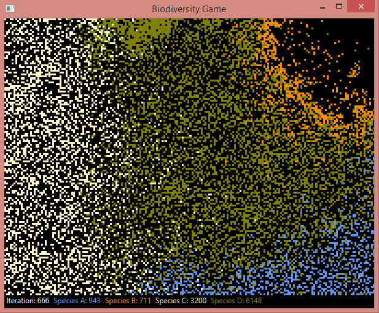

# Biodiversity Game

## General Information
The Biodiversity simulation game provides simplistic model of organisms living in an environment. Any single organism is a real digital object, which appear as tiny color square at rectangular display. User can configure both setting of environment and species at the starting point. Then, as the simulation starts, various species should colonize the territory or die out according to their fitness and interaction with other species. Simulation counts and displays number of organisms in runtime.   

Project of approx. 2.6 k lines of code including 440 lines of tests. Outer layer of architecture is dependent on MVC  pattern. Internal model scheme bases on composition rather than on inheritance. I used combined strategy and decorator patterns to enable further development, for creating complex objects builder or factory.

"WARNING: Running this simulation may potentially trigger seizures for people with photosensitive epilepsy. Viewer discretion is advised."

## Simulation Display

## Technologies Used
- java 11.0.10
- javafx 11
- maven 4.0.0
- junit 5.4.0
- mockito 1.10.19
- lombok 1.18.20
- log4j 2.14.1
- jackson-databind 2.12.3

## Setup
Game has its default setting resources/config.json, program can still run without it.

## Future Development
- increase test coverage
- more sophisticated behavior for the organisms
- modelling evolutionary process
- displaying statistic graphs

## Acknowledgements
- Many thanks to:
- dixu11 for general java knowledge
- anonymous code reviewer 
- ritaly for template for this readme
